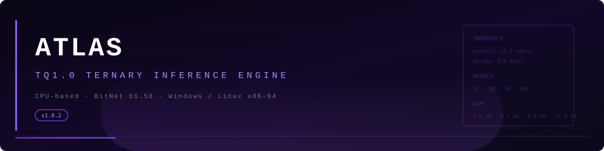

<p align="center">
  
</p>

# ATLAS — TQ1.0 Ternary Inference Engine

CPU inference engine for BitNet b1.58 ternary-quantized models (Falcon3, Bonsai/Qwen3). Repacks HuggingFace safetensors into **TQ1.0** format (5 ternary trits/byte, Base-3) and runs fast inference via C++ DLL/SO + Python. **Windows + Linux x86-64**, no GPU, 8-16 GB RAM.

> ⚡ **v2.4.1**: Full Bonsai/Qwen3 support — YaRN RoPE, QK-Norm, Tie Embeddings, per-row block-scaled TQ1 (g128), 5 critical C++ bugs fixed, 10× Bonsai speedup via int8 cache.

## Supported Models

| Model | Atlas Size | Layers | Hidden | Intermediate | Heads | KV Heads | Vocab |
|-------|-----------|--------|--------|-------------|-------|----------|-------|
| Falcon3-1B-Instruct | 1.22 GB | 18 | 2048 | 8192 | 8 | 4 | 131072 |
| Falcon3-3B-Instruct | 1.96 GB | 22 | 3072 | 9216 | 12 | 4 | 131072 |
| Falcon3-7B-Instruct | 2.75 GB | 28 | 3072 | 23040 | 12 | 4 | 131080 |
| Falcon3-10B-Instruct | 3.28 GB | 40 | 3072 | 23040 | 12 | 4 | 131072 |
| Ternary-Bonsai-1.7B-unpacked | 0.86 GB | 28 | 2048 | 6144 | 16 | 8 | 151669 |
| Ternary-Bonsai-4B-unpacked | 1.45 GB | 36 | 2560 | 9728 | 32 | 8 | 151669 |
| Ternary-Bonsai-8B-unpacked | ~3 GB | 36 | 4096 | 12288 | 32 | 8 | 151669 |

Falcon3: `head_dim=256`, `rope_theta=1000042`, GQA.  
Ternary-Bonsai/Qwen3: `head_dim=128`, `rope_theta=1M` (1.7B/8B) or `5M` (4B), YaRN factor=4.0, Tie Embeddings, QK-Norm, SwiGLU.  
All v5/v6 `.atlas` format — embeds tokenizer (v6: binary pool-lookup decode, no external deps).

### Model Sources

| Model (source) | HF Repo |
|----------------|---------|
| Ternary-Bonsai | `prism-ml/Ternary-Bonsai-*-unpacked` (FP16 safetensors, needs repacking) |
| Ternary-Bonsai | `prism-ml/Ternary-Bonsai-*-gguf` (GGUF, for llama.cpp) |
| Ternary-Bonsai | `prism-ml/Ternary-Bonsai-*-mlx-2bit` (MLX, for Apple Silicon) |
| Falcon3 | `tiiuae/Falcon3-*-Instruct` (must be ternarized via ATLAS packer) |

All are Apache 2.0 licensed.

## Quick Start

```bash
# Runtime only (inference):
pip install numpy
# For repacking models from safetensors:
pip install numpy safetensors transformers
```

### Generate (C++ core)

```python
from atlas_infer import AtlasModel

model = AtlasModel('falcon3-10b-tq1.atlas')

# Deterministic generation
print(model.generate_c("What is the capital of France?", temperature=0.0))

# Sampling with repetition penalty
model.set_seed(42)
print(model.generate_c("Tell me about Paris", temperature=0.7, top_k=40, top_p=0.9, repetition_penalty=1.1))

# Streaming
for chunk in model.generate_stream("Write a short poem", max_new_tokens=100):
    print(chunk, end="", flush=True)

# Chat with system prompt
model.set_system_prompt("You are a helpful assistant.")
messages = [
    {"role": "user", "content": "What is the capital of France?"}
]
print(model.generate_c(messages, temperature=0.7))
```

### Build from source

**Windows:**
```bash
compile.bat
```

**Linux:**
```bash
chmod +x compile-linux.sh && ./compile-linux.sh
```

Requires Clang (Windows) or GCC (Linux) with OpenMP, AVX2+FMA.

### Repacking from Safetensors

```bash
# Falcon3: download from tiiuae/Falcon3-*-Instruct
python atlas_pack.py path/to/falcon3-model-dir

# Bonsai: download from prism-ml/Ternary-Bonsai-*-unpacked
python atlas_pack.py path/to/bonsai-model-dir
```

The CLI autodetects model family from `config.json` and generates the output filename automatically (e.g. `falcon3-10b-tq1.atlas` or `bonsai-4b-tq1-g128.atlas`). Requires `transformers` + `torch` for tokenizer config (install via `pip install -r requirements-dev.txt`).

## Python API

```python
from atlas_infer import AtlasModel

model = AtlasModel("path/to/model.atlas")

# Deterministic generation
output = model.generate_c("Your prompt", temperature=0.0)

# Sampling
output = model.generate_c("Your prompt", temperature=0.7, top_k=40, top_p=0.9,
                          max_new_tokens=200, repetition_penalty=1.1)

# Streaming
for chunk in model.generate_stream("Tell me a story", max_new_tokens=100):
    print(chunk, end="", flush=True)

# Chat with system prompt
model.set_system_prompt("You are a helpful assistant.")
messages = [{"role": "user", "content": "What is the capital of France?"}]
print(model.generate_c(messages, temperature=0.7))

# Matmul mode control
model.set_use_f32_matmul(True)    # pure float32 (reference, no quantization)
model.set_use_hybrid_matmul(True) # FFN int8 + QKV packed (default)
model.set_use_packed_matmul(True) # all TQ1-packed (slowest, for testing)

# Thread control
model.set_num_threads(4)
```

| Method | Description |
|--------|-------------|
| `AtlasModel(path)` | Load `.atlas` model. Optional `model_dir` for tokenizer config fallback. |
| `generate_c(text, ...)` | Generate text. Accepts string or `list[dict]` messages. Returns string. |
| `generate_stream(text, ...)` | Generator yielding token strings as they're produced. |
| `set_system_prompt(text)` | Set system prompt for chat mode. |
| `set_seed(seed)` | Seed the RNG (default: random). |
| `set_num_threads(n)` | Set OpenMP thread count. |
| `set_use_f32_matmul(bool)` | Toggle f32 bypass mode (auto-enabled for hidden≤2048). |
| `set_use_hybrid_matmul(bool)` | Toggle hybrid FFN-int8 + QKV-packed mode (default). |
| `set_use_packed_matmul(bool)` | Toggle full TQ1-packed mode (all matmuls, no decompress). |

## Performance

### v2.4.1 — Current (Bonsai + Bugfix Release)

Measured on **Intel Core i7-7700T** (Kaby Lake, 4C/8T @ 2.9 GHz). `generate_c()` at T=0, 30 tokens, warm. All models produce correct output at T=0.

| Model | Mode | tok/s | Quality (T=0) |
|-------|------|:-----:|---------------|
| **Falcon3-3B** | hybrid+int8 | 4.3 | "Paris. Paris is a city in France." |
| **Bonsai-1.7B** | f32 bypass | **13.0** | "The capital of France is **Paris**." |
| **Bonsai-1.7B** | hybrid+int8 | 19.2 | "The capital of France is Paris." |
| **Bonsai-4B** | hybrid+int8 | **15.2** | "The capital of France is Paris." |

Bonsai-1.7B defaults to f32 bypass (hidden=2048). Quantized hybrid yields higher throughput with minor quantization noise.

### Hybrid Mode (default, v1.3.2+)

FFN projections (gate/up/down) run as decompressed int8 — they dominate compute. QKV/O projections stay in TQ1-packed format (5× fewer bytes read). Int8 KV-cache with per-position scaling (v2.3.0). For small models (hidden≤2048), f32 bypass auto-activates to eliminate activation quantization noise.

### Int8 Weight Cache

On first load, a `.i8` companion file is created (decompressed int8). Subsequent loads mmap it directly for sub-second startup. Bonsai models cache 196–252 tensors (~1.4–3.6 GB).

### Int8 KV-Cache (v2.3.0, Internal)

The KV-cache is int8-quantized with dynamic per-position scaling (one float32 scale per KV-head per position). No manual allocation or management needed — `atlas_forward` calls `ensure_cache(max_seq_len)` internally. API signatures no longer carry `k_cache`/`v_cache` parameters.

**RAM savings**: 10B@4K context: 320 MB (fp16) → 173 MB (int8). SIMD in-flight dequantization in attention hotpath adds no measurable overhead.

### 🛠️ Windows Runtime Troubleshooting

If you compile using the LLVM-MinGW toolchain and encounter a `FileNotFoundError` or activation error when loading `atlas.dll` via ctypes, ensure the following MinGW runtime DLLs are placed in your working directory (next to `atlas.dll`):
- `libunwind.dll`
- `libwinpthread-1.dll`
- `libc++.dll`
- `libomp.dll` (OpenMP parallelization backend)

These are shipped with the LLVM-MinGW distribution under `x86_64-w64-mingw32\bin\`. Copy them next to `atlas.dll` or add that directory to your `PATH`.

## Architecture

```
safetensors → atlas_packer.py → .atlas file → atlas_infer.py → atlas.dll / libatlas.so
                                                         |
                                                    atlas_forward (fused N layers, C++)
                                                         |
                                              ┌──────────┼──────────┐
                                          RMSNorm  Attention  FFN(SiLU)
                                         (C++)   (int8 KV)   (int8/packed)
                                                         |
                                               Final RMSNorm + LM head GEMV (int8)
```

### Pipeline

1. **Packer** (`atlas_packer.py`): De-interleaves BitNet's 4-row-packed uint8 → Base-3 TQ1. 5 trits per byte, padded with ternary-0.
2. **v5/v6 file format**: v5: 64-byte header (magic `"ATLAS"`, version=5, model hyperparameters, tokenizer offset/size), 12-byte tensor directory, name block, data, embedded tokenizer.json. v6: same structure + binary tokenizer block (128-byte header, pool offsets/lengths, BPE merges, byte_encoder, special tokens) — enables C++ pool-lookup decode without `transformers` or `tokenizers` libraries. C API `atlas_get_tokenizer()` exposes v5 JSON or v6 binary block. `AtlasModel('model.atlas')` suffices, no external model directory.
3. **C++ library** (`atlas_api.cpp`, single source for Windows + Linux): Loads the atlas file into memory. TQ1 tensors are decompressed to int8 with per-tensor `valloc`/`vfree` (`VirtualAlloc` on Windows, `mmap` on Linux). `atlas_forward` runs all N layers in one fused C++ call — RMSNorm + 7× int8 matmul (Q/K/V/O/gate/up/down) + fused GQA attention (RoPE + int8 KV-cache + causal softmax + weighted sum) + fused FFN (gate+up in one OMP region, SiLU+mul+quantize fused into down projection) — with no Python round-trips between layers. Ping-pong buffers avoid per-layer copies. KV-cache is int8-quantized with per-position scaling (`v2.3.0`), fully internal — no manual cache management needed.
4. **Int8 KV-Cache (v2.3.0)**: FP16→int8 quantization with dynamic scale per (KV-head, position). 10B@4K: 320 MB → 173 MB RAM. SIMD in-flight dequantization in attention hotpath. Cache is fully encapsulated in the C++ model struct — no k_cache/v_cache parameters in `atlas_forward` or Python API.
5. **Tokenizer (v6)**: Python `tokenizers` for encode (Falcon3's byte_encoder is fundamentally incompatible with C++ byte-level pre-encode — 191/256 byte tokens overwritten by special tokens). C++ pool-lookup for decode (`O(1)` per token). `_apply_chat_template` renders Falcon3 Jinja2 format without `transformers`.
6. **Matmul modes**: int8 (`vpmaddubs_epi16`), f32 bypass (`vfmadd231ps`), ternary-add (`vpsignb`), TQ1-packed (chunked decode + SIMD). Switched at runtime.
7. **Sampling**: Softmax multinomial with top-k/top-p (v2.0.4, replaced Gumbel-max). Xoshiro256** PRNG. T=0 → argmax. Optimized survivor-list collection (top-k prunes to ~40 candidates, top-p operates on survivors only — eliminates O(V log V) sort).
8. **Streaming** (v2.1.0): `atlas_generate_stream` callback C API, Python `generate_stream` generator. `set_system_prompt()` for context injection. Chat history via `list[dict]` messages with `_apply_chat_template`.
9. **Repetition penalty** (v2.1.1): Applied in C-core before top-k pruning, exposed in `generate_c`/`generate_stream`.

## Bugfix Chronology

20+ bugs were discovered and fixed during development. See [BUGS.md](BUGS.md) for the full chronology — `fseek` 32-bit overflow, Base-3 vs 2-bit packing, K/V cache swap, RMSNorm truncation, stack overflow, and 15+ more.

All four Falcon3 models (1B, 3B, 7B, 10B) and Bonsai models (1.7B, 4B) pass coherence at T=0.

## Files

| File | Purpose |
|------|---------|
| `atlas_packer.py` | Falcon3 safetensors → TQ1 v5/v6 (embedded + optional binary tokenizer) |
| `atlas_packer_bonsai.py` | Bonsai/Qwen3 safetensors → g128 block-scaled TQ1 (ttype=5, per-row per-block fp16 scales) |
| `add_v6_block.py` | Append v6 binary tokenizer block to existing v5 files (fast migration) |
| `atlas_infer.py` | Python inference engine |
| `atlas_api.cpp` | C++ library (load, forward, matmul, attention, norms, binary tokenizer, int8 KV-cache) |
| `atlas_ffi.h` | C API contract |
| `falcon3-{1,3,7,10}b-tq1.atlas` | Packed Falcon3 models |
| `bonsai-{1.7,4}b-tq1-g128.atlas` | Packed Bonsai/Qwen3 models (g128 block-scaled) |
| `atlas_pack.py` | Unified CLI — autodetects model family, dispatches to correct packer |

## Version History

| Version | Key Changes |
|---------|-------------|
| **v2.4.1** | Static analysis bughunt (5 C++ bugs), ttype=5 int8 decompress for Bonsai (10× speedup), unified packer CLI, `generate()` chat template fix, repo cleanup |
| **v2.4.0** | Qwen3/Bonsai-4B TQ1.0 support — head_dim=128, QK-Norm, YaRN RoPE, Tie Embeddings, dynamic vocab |
| **v2.3.1** | Windows packer hotfix (`out.flush()` before `seek`), 7B v6 repair |
| **v2.3.0** | Int8 KV-Cache (fp16→int8, dynamic scaling, internal `ensure_cache()`), 10B@4K: 320→173 MB |
| **v2.2.2** | F16C in attention score + weighted sum (batch `_mm256_cvtph_ps` + FMA), 10B +47%, 3B +5.7% |
| **v2.2.1** | BPE-PQ priority queue in tokenizer merge (O(n²)→O(n log n)), 1401 tokens in 24ms |
| **v2.2.0** | TQ1-LUT in decompression (replace %3//3 with lookup), F16C (`_mm256_cvtph_ps`) for fp16→fp32 in RMSNorm + scalar, ~30% throughput |
| **v2.1.1** | Repetition penalty in C-core (before top-k), exposed in Python API |
| **v2.1.0** | Streaming (`atlas_generate_stream` callback C API, Python `generate_stream` generator), `set_system_prompt`, chat history via `list[dict]` messages |
| **v2.0.4** | Softmax sampling (replace Gumbel-max), thread_local→static revert, default T=0.7 |
| **v2.0.3** | n_input ≥ max_seq_len guard (CRITICAL), scores_buf OOM guard (Bug 9) |
| **v2.0.2** | Memory leak fix (`__del__`), KV-cache overflow clamp, stale .i8 cache validation, thread-local statics, seed=0 pass-through |
| **v2.0.1** | `scores` alloca → heap (stack fully sterile) |
| **v2.0.0** | C++ binary tokenizer (v6 format) — no `transformers` dependency at runtime |
| **v1.4.0** | Stack overflow fix, survivor-list sampling optimization |
| **v1.3.2** | Hybrid mode (FFN int8 + QKV packed), per-tensor dispatch |
| **v1.3.1** | Direct TQ1-packed matmul, `atlas_set_num_threads` |
| **v1.3.0** | Ternary-add kernel (`vpsignb`), eliminates row_sum correction |
| **v1.2.0** | C++ sampling (Xoshiro256**, Gumbel-max), `atlas_generate` |
| **v1.1.0** | AllocHdr-based valloc/vfree, production hardening |
| **v1.0.0** | Initial TQ1.0 inference engine |

## License

Code: Apache 2.0. BitNet b1.58: Microsoft Research. Falcon3: TII (subject to [TII Falcon License 1.0](https://falconllm.tii.ae/)).
